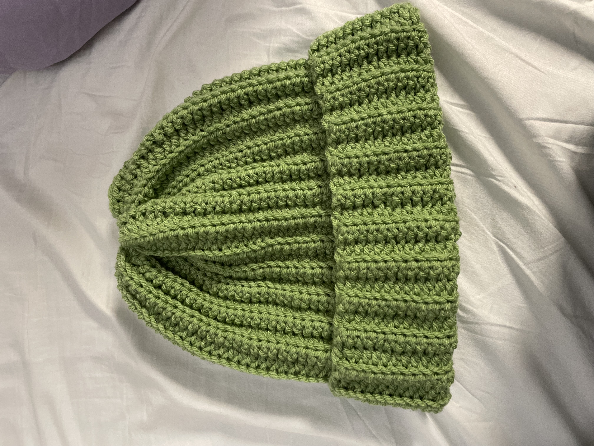
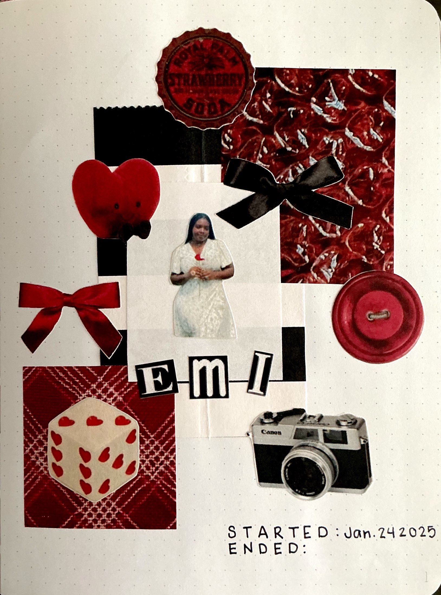
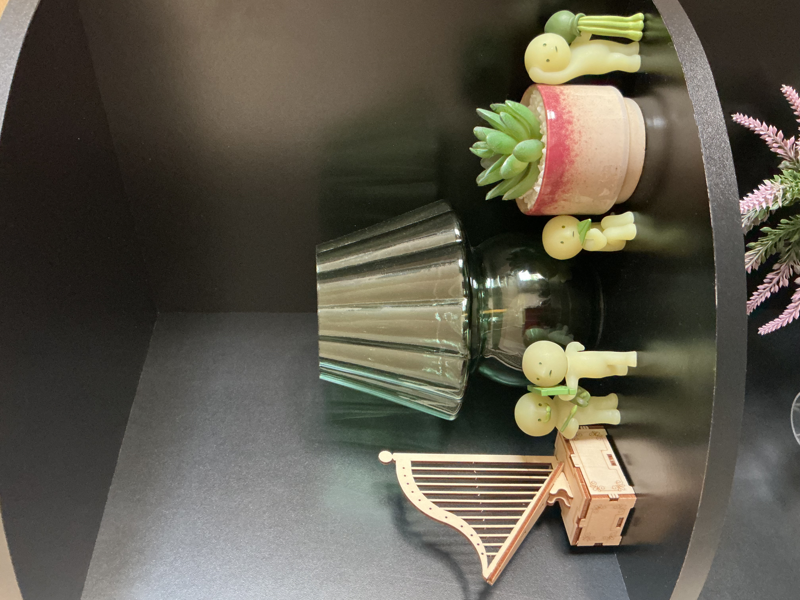
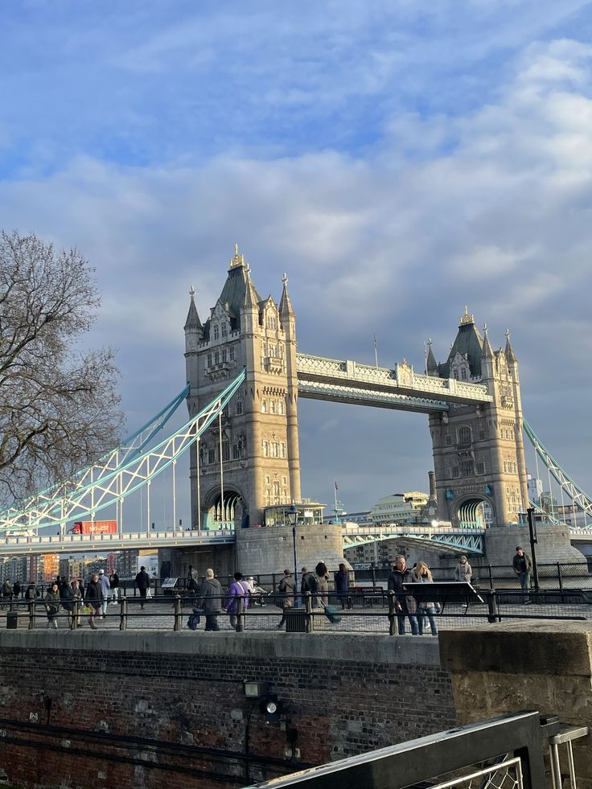
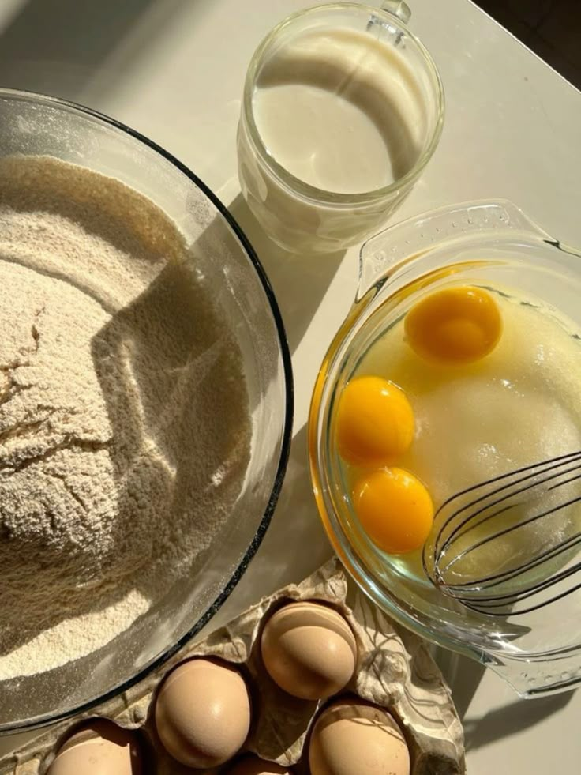
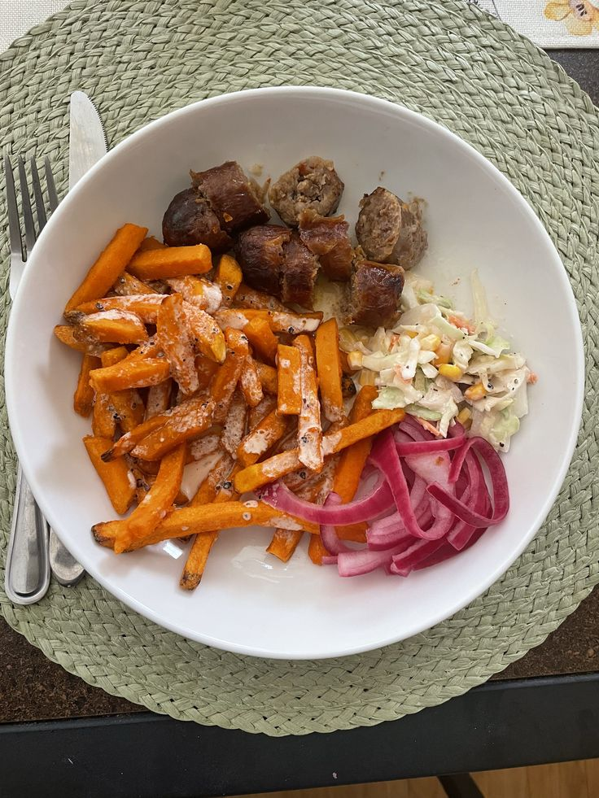

<html>
<h1 style="background-color:#ff6347;">...</h1>
<head>
<title>Emioritse's Hobbies</title>
</head>

<body>

<h1>Emioritse's Hobbies</h1>

<h3>My Hobbies</h3>

I have always loved being creative and finding outlets for it. So, over the years I have amassed may hobbies like crochet, jewelry making, drawing, and painting.

Some of my current hobbies include:

<ol>
<li>Crochet: Crochet is a fiber art that involves creating textiles by using a crochet hook to interlock loops of yarn. I have crocheted beanines, scarves, jackets, tops, and more! 
<li>Junk Journaling: Junk Journaling is a creative way that individuals construct handmade journals from recycled materials and "junk" like old books, magazines, envelopes, receipts, and ephemera. Junk Journaling has been an outlet for me for about 4 years now. 
<li>Collecting Blind Boxes: Collecting Blind Boxes is the process of buying and opening different trinkets or characters without knowing which one you are getting. My favorites to collect are Smiskis, Sonny Angels, Crybabies, and Miffy. 
<li>Photography: Photography is the art of taking and processing photographs. I actualy took a photography class in high school and was a teacher's assistant! 
<li>Cooking/Baking: Cooking and Baking involves using ingredients, science, and kitchen tools to make dishes and desserts. I think I am better at baking than cooking, but I enjoy cooking more. 
</ol>

<h3>Pictures of My Hobbies</h3> 
  
  
 
 
 
 
 
 
 
 

<a href=“mailto:emiab_05@tamu.edu”>Email Me!</a>
</body>
</html>
